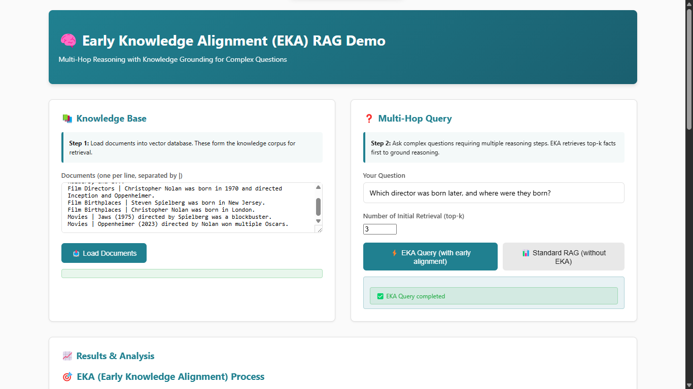
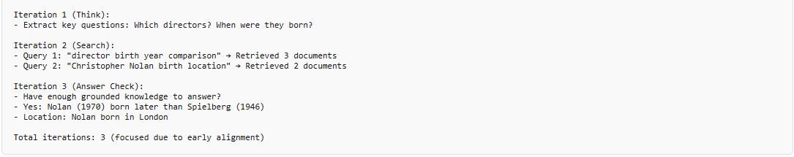

# EKA (Early Knowledge Alignment) Interactive Demo

An interactive demonstration of Early Knowledge Alignment (EKA) for improving multi-hop reasoning in Retrieval-Augmented Generation (RAG) systems.

## Overview

This demo visualizes how early knowledge retrieval improves multi-hop reasoning by grounding LLM planning with relevant facts first, reducing search entropy and enhancing answer accuracy.

## Key Features

- 📚 **Load Documents**: Add documents to a mock vector database
- ❓ **Multi-Hop Questions**: Ask complex questions requiring multiple reasoning steps (e.g., "Which director was born later?")
- ⚡ **EKA Queries**: Run queries with early retrieval and grounded reasoning
- 📊 **Comparison Mode**: Compare EKA with Standard RAG (blind decomposition)
- 📈 **Step-by-Step Visualization**: View the reasoning process, metrics, and advantages

## How EKA Works

### 1. Early Alignment
Retrieve top-k relevant documents first to ground knowledge before planning.

### 2. Grounded Planning
LLM plans the reasoning path using the retrieved corpus knowledge.

### 3. Focused Iteration
Think-Search-Answer cycle with reduced entropy through early grounding.

### 4. Answer
Generate factually grounded responses with improved accuracy.

## Demo Structure

The demo consists of:
- Document loading interface
- Question input
- EKA vs Standard RAG comparison
- Step-by-step process visualization
- Performance metrics display

## Usage

1. Open `index.html` in a web browser
2. Load sample documents or add your own
3. Enter a multi-hop question
4. Run EKA query and compare with standard RAG
5. Observe the reasoning process and metrics

## Screenshots

### Main Interface

### EKA vs Standard RAG Comparison

### Step-by-Step Reasoning

## Contributing

This demo is part of the [Early Knowledge Alignment](https://github.com/yxzwang/EarlyKnowledgeAlignment) project. To contribute:

1. Fork the repository
2. Create a feature branch
3. Make your changes
4. Submit a pull request

Credits to the original authors at https://github.com/yxzwang/EarlyKnowledgeAlignment for their groundbreaking work on improving multi-hop reasoning in RAG systems.

## License

See the main project repository for licensing information.